# Lab 2 — Validación de endpoints PUT y DELETE con túnel SSH

API REST de tareas (ToDo) construida en Node.js puro con autenticación JWT. El servidor corre en una VM de Google Cloud y se consume desde la máquina local mediante un túnel SSH.

---

## Infraestructura

| Componente | Descripción |
|------------|-------------|
| Servidor | VM en Google Cloud (`jaucor.online`) |
| Puerto | 3000 |
| Acceso | Túnel SSH con port forwarding |
| Cliente | Máquina local con `curl` |

---

## Paso 1 — Conexión SSH a la VM

```bash
ssh -i ~/.ssh/id_ed25519_portfolio jauricortescardenas@jaucor.online
```

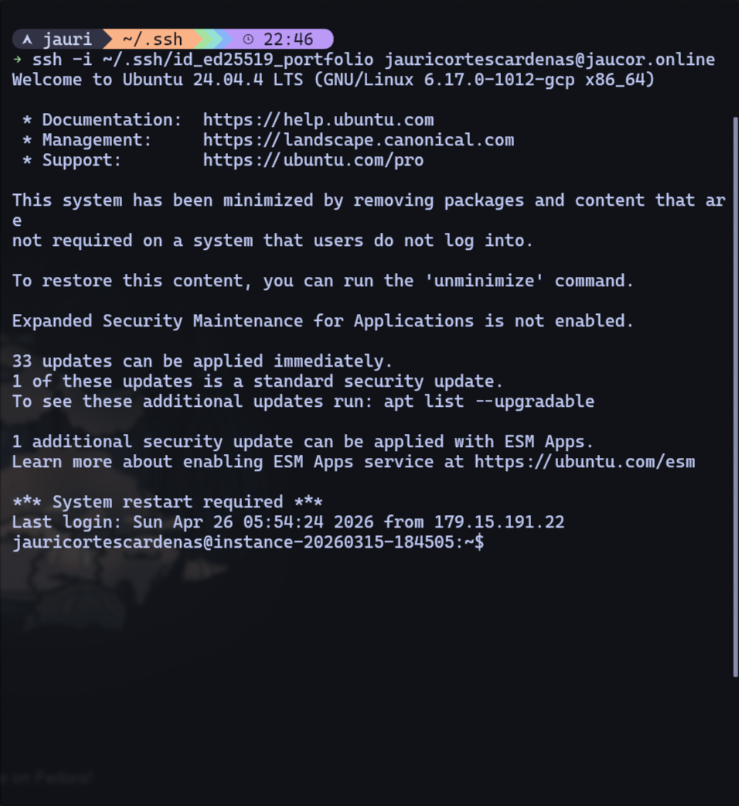

---

## Paso 2 — Copiar el servidor a la VM

```bash
scp -i ~/.ssh/id_ed25519_portfolio \
  "server.js" \
  jauricortescardenas@jaucor.online:~/lab_2/
```

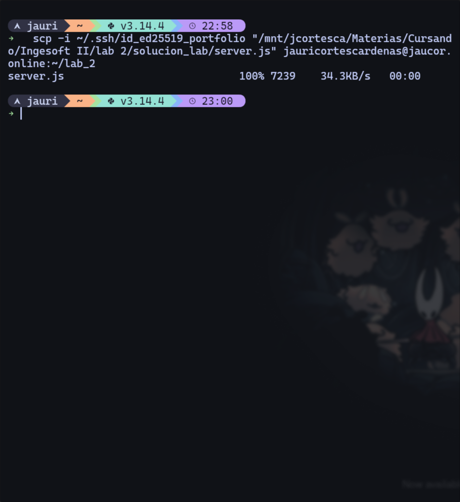

Verificación dentro de la VM con `ls`:

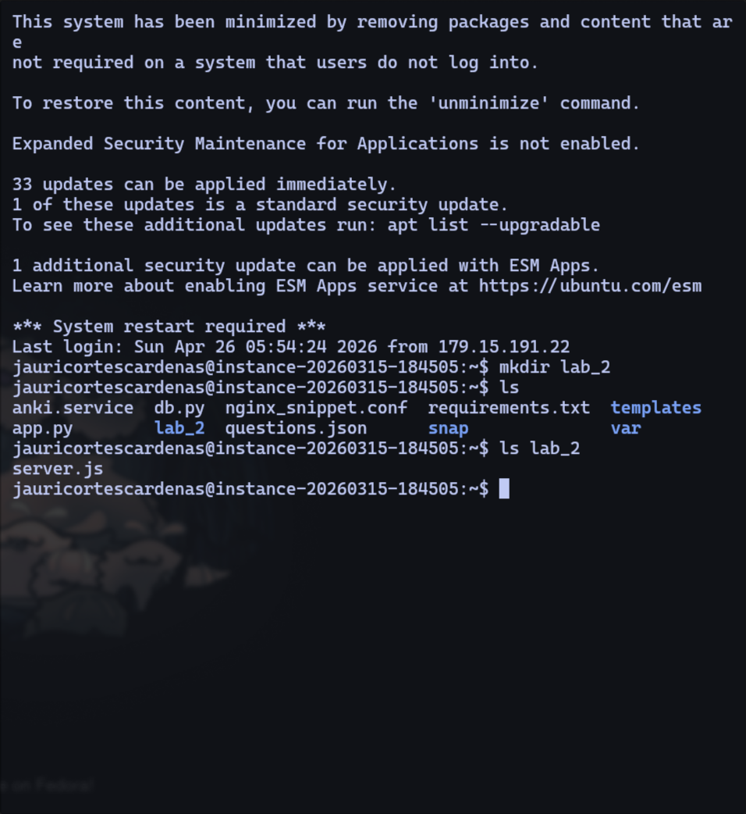

---

## Paso 3 — Levantar el servidor en la VM

```bash
node server.js
```

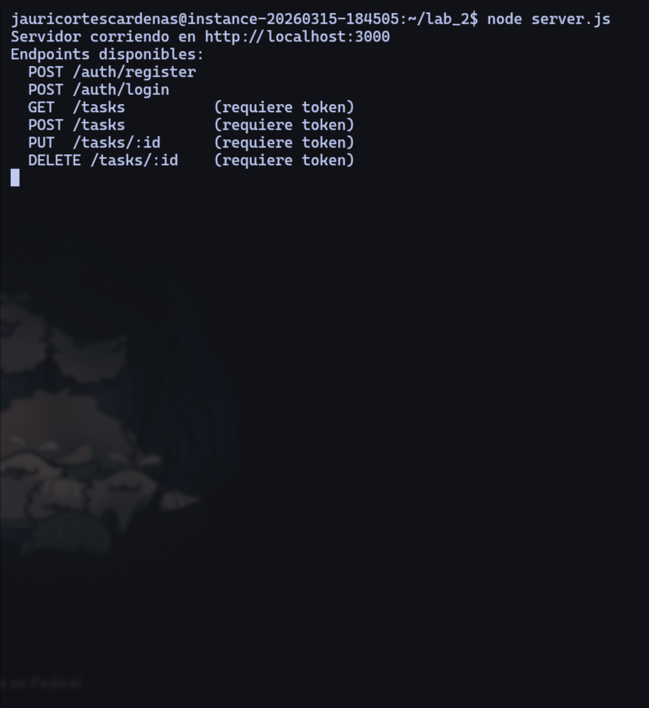

---

## Paso 4 — Túnel SSH (port forwarding)

Desde la máquina local, se trae el puerto 3000 de la VM al local:

```bash
ssh -i ~/.ssh/id_ed25519_portfolio -L 3000:localhost:3000 jauricortescardenas@jaucor.online -N
```

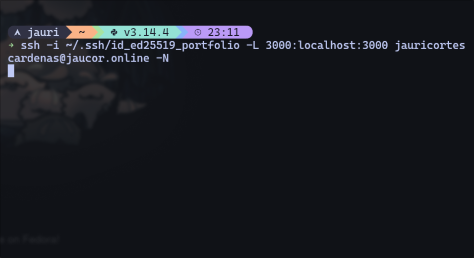

A partir de aquí todos los `curl` se hacen a `http://localhost:3000`, pero el tráfico viaja encriptado por SSH hasta el servidor en la VM.

---

## Paso 5 — POST /auth/register

Crear un usuario nuevo:

```bash
curl -s -X POST http://localhost:3000/auth/register \
  -H "Content-Type: application/json" \
  -d '{"username":"jauri","email":"jauri@test.com","password":"pass123"}'
```

**Respuesta — 201 Created:**
```json
{
  "message": "Usuario creado",
  "userId": "1778127407587"
}
```

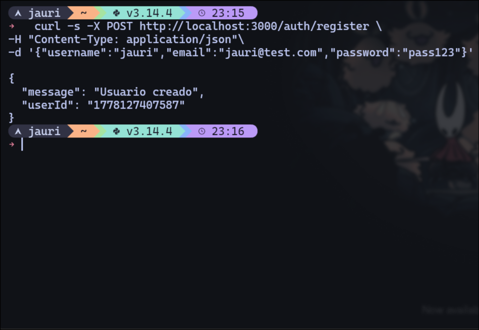

---

## Paso 6 — POST /auth/login

Hacer login y obtener el token JWT:

```bash
curl -s -X POST http://localhost:3000/auth/login \
  -H "Content-Type: application/json" \
  -d '{"email":"jauri@test.com","password":"pass123"}'
```

**Respuesta — 200 OK:**
```json
{
  "token": "eyJhbGci..."
}
```

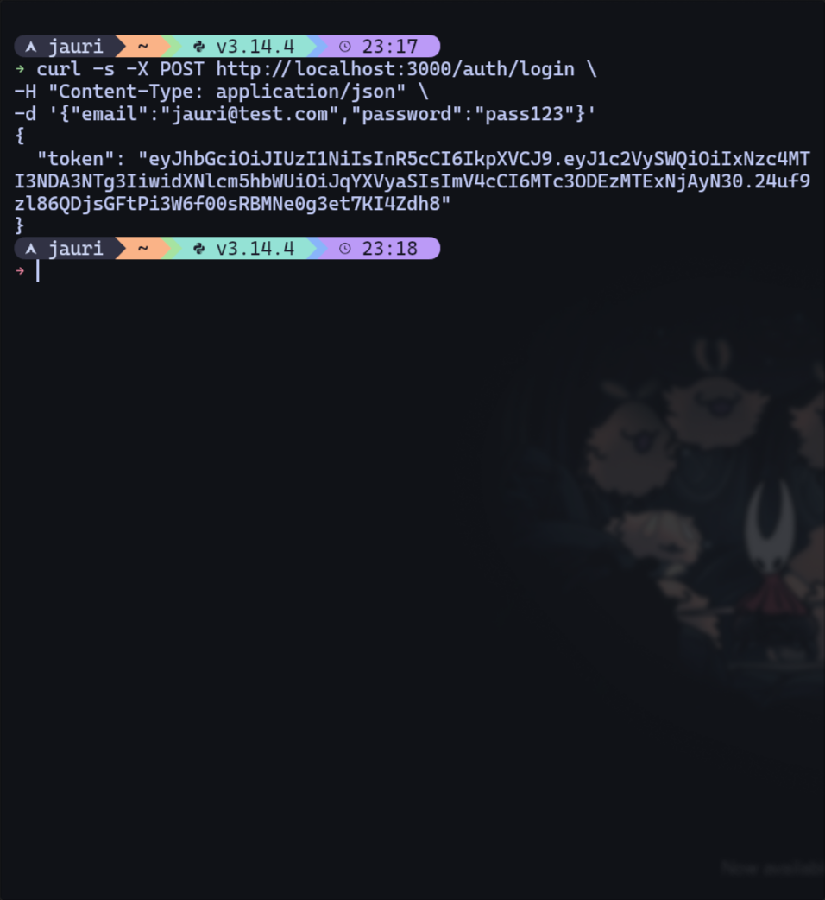

Se guarda el token en una variable para usarlo en los siguientes requests:

```bash
TOKEN=$(curl -s -X POST http://localhost:3000/auth/login \
  -H "Content-Type: application/json" \
  -d '{"email":"jauri@test.com","password":"pass123"}' \
  | python3 -c "import sys,json; print(json.load(sys.stdin)['token'])")
```

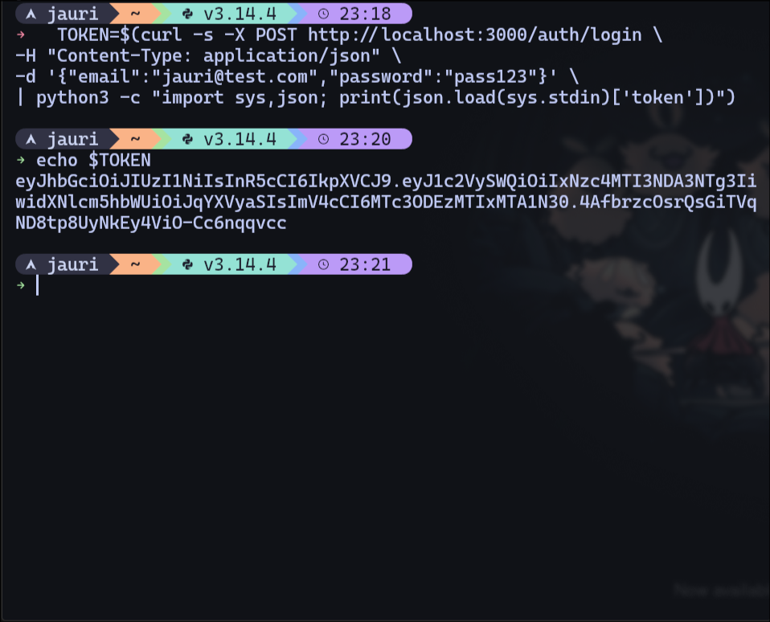

---

## Paso 7 — POST /tasks

Crear una tarea y guardar su id:

```bash
TAREA=$(curl -s -X POST http://localhost:3000/tasks \
  -H "Content-Type: application/json" \
  -H "Authorization: Bearer $TOKEN" \
  -d '{"title":"Tarea de prueba","description":"Para probar PUT y DELETE"}')

echo $TAREA
ID=$(echo $TAREA | python3 -c "import sys,json; print(json.load(sys.stdin)['id'])")
```

**Respuesta — 201 Created:**
```json
{
  "id": "1778127847398",
  "title": "Tarea de prueba",
  "description": "Para probar PUT y DELETE",
  "status": "pending",
  "userId": "1778127407587",
  "createdAt": "2026-05-07T04:24:07.398Z"
}
```

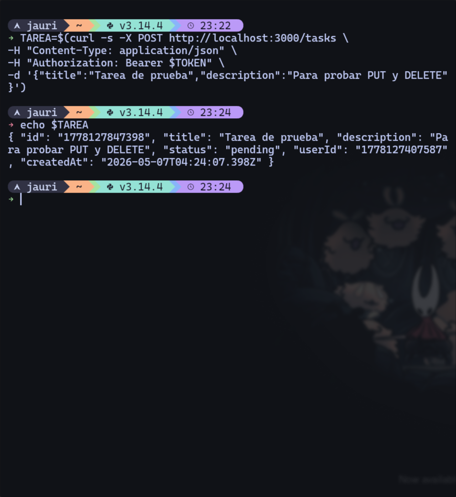

---

## Paso 8 — PUT /tasks/:id

Actualizar el status de la tarea a `completed`:

```bash
curl -s -X PUT http://localhost:3000/tasks/$ID \
  -H "Content-Type: application/json" \
  -H "Authorization: Bearer $TOKEN" \
  -d '{"status":"completed"}'
```

**Respuesta — 200 OK:**
```json
{
  "id": "1778127847398",
  "title": "Tarea de prueba",
  "description": "Para probar PUT y DELETE",
  "status": "completed",
  "userId": "1778127407587",
  "createdAt": "2026-05-07T04:24:07.398Z"
}
```

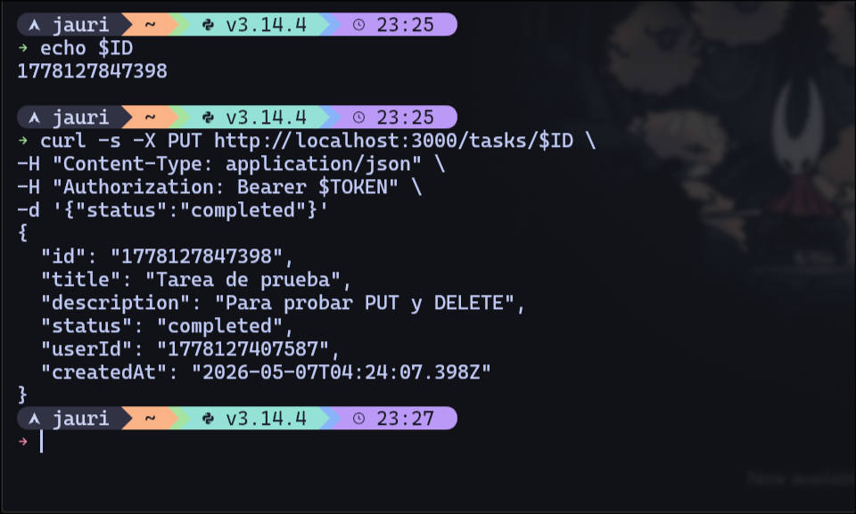

---

## Paso 9 — DELETE /tasks/:id

Eliminar la tarea:

```bash
curl -v -X DELETE http://localhost:3000/tasks/$ID \
  -H "Authorization: Bearer $TOKEN"
```

**Respuesta — 204 No Content** (sin body, la tarea fue eliminada):

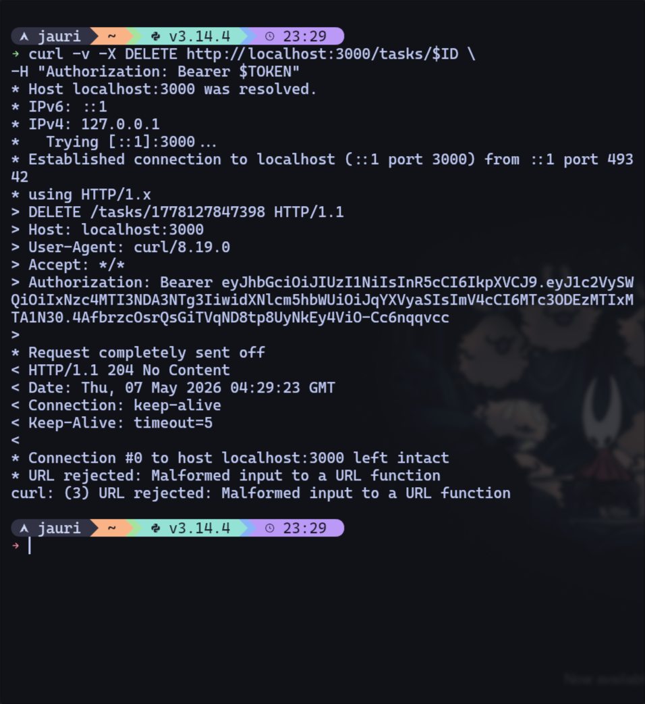

---

## Resumen de endpoints validados

| Método | Ruta | Status | Resultado |
|--------|------|--------|-----------|
| POST | `/auth/register` | 201 | Usuario creado |
| POST | `/auth/login` | 200 | Token JWT recibido |
| POST | `/tasks` | 201 | Tarea creada con status `pending` |
| PUT | `/tasks/:id` | 200 | Status actualizado a `completed` |
| DELETE | `/tasks/:id` | 204 | Tarea eliminada |
