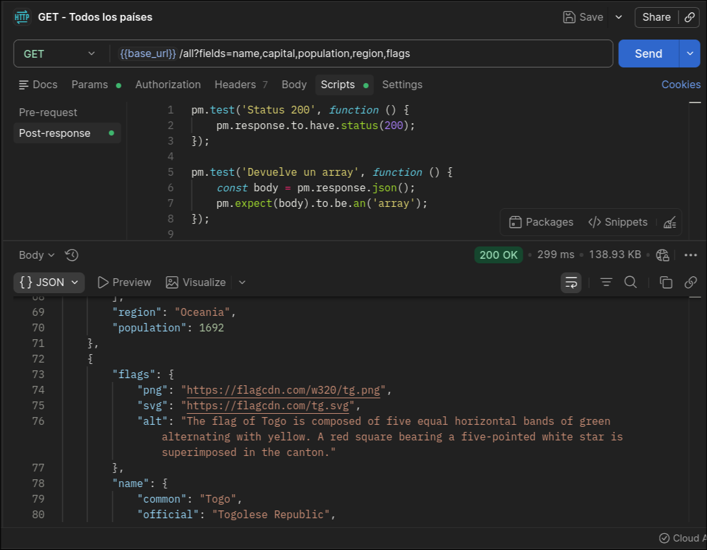
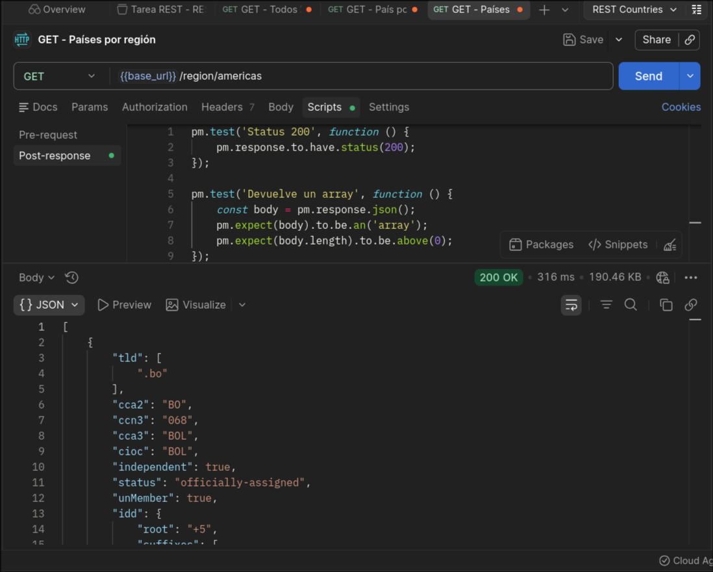
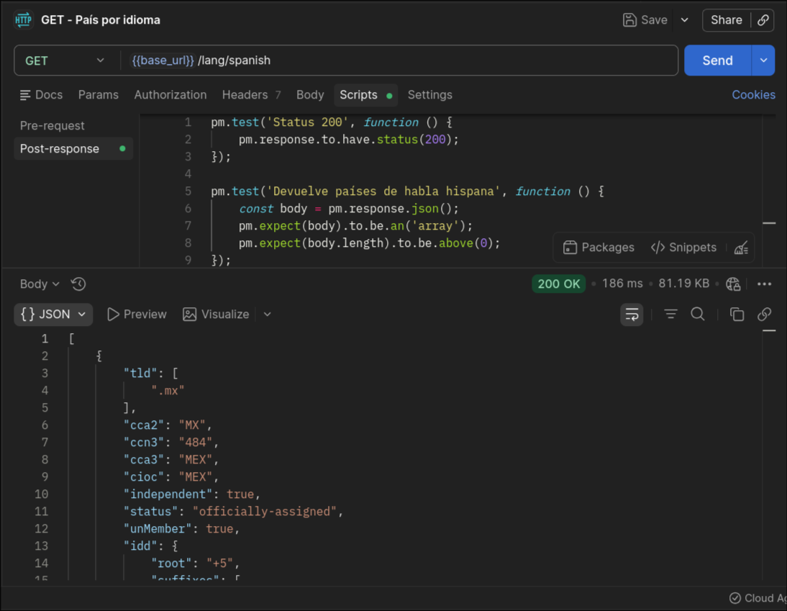
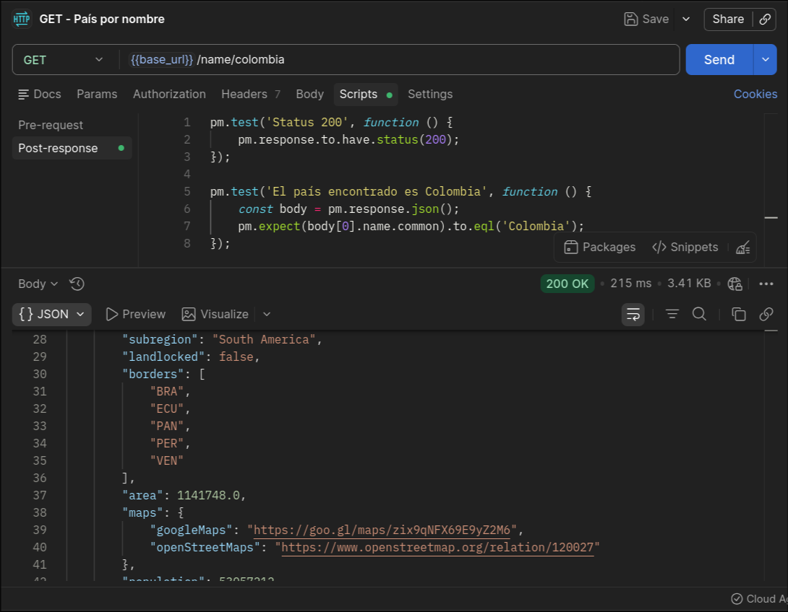
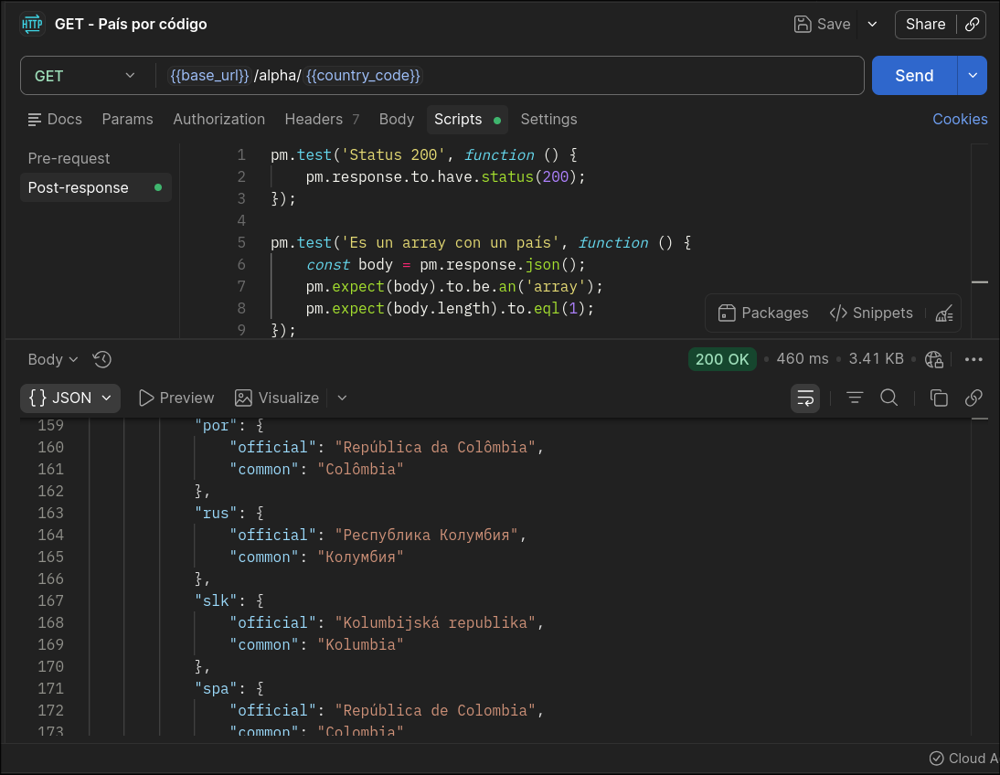
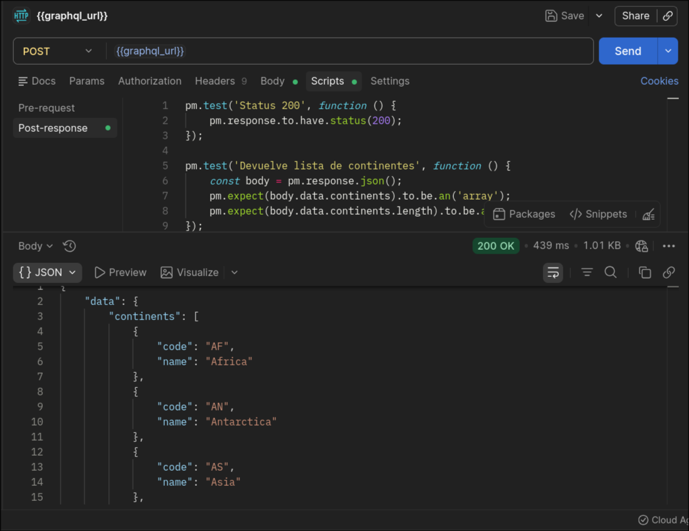
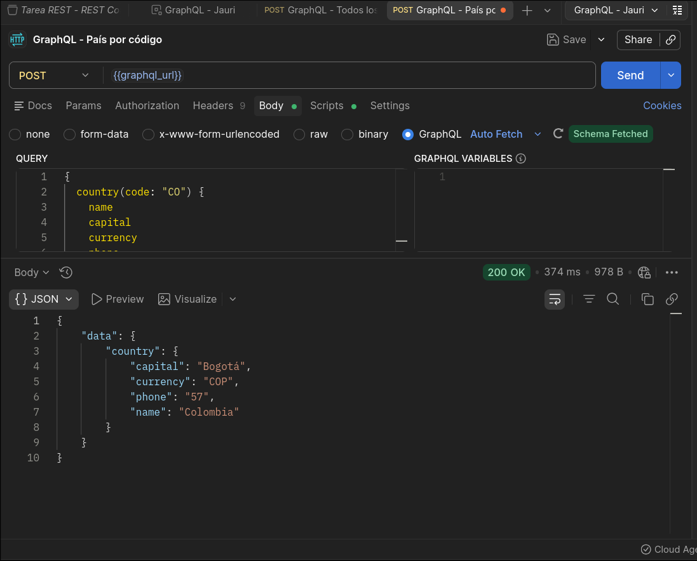
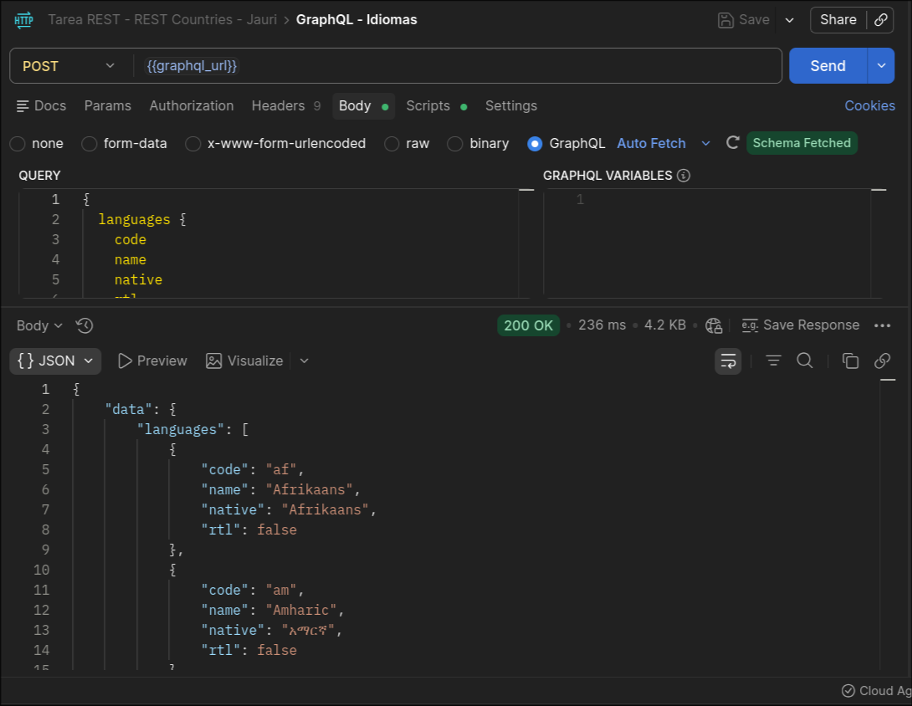
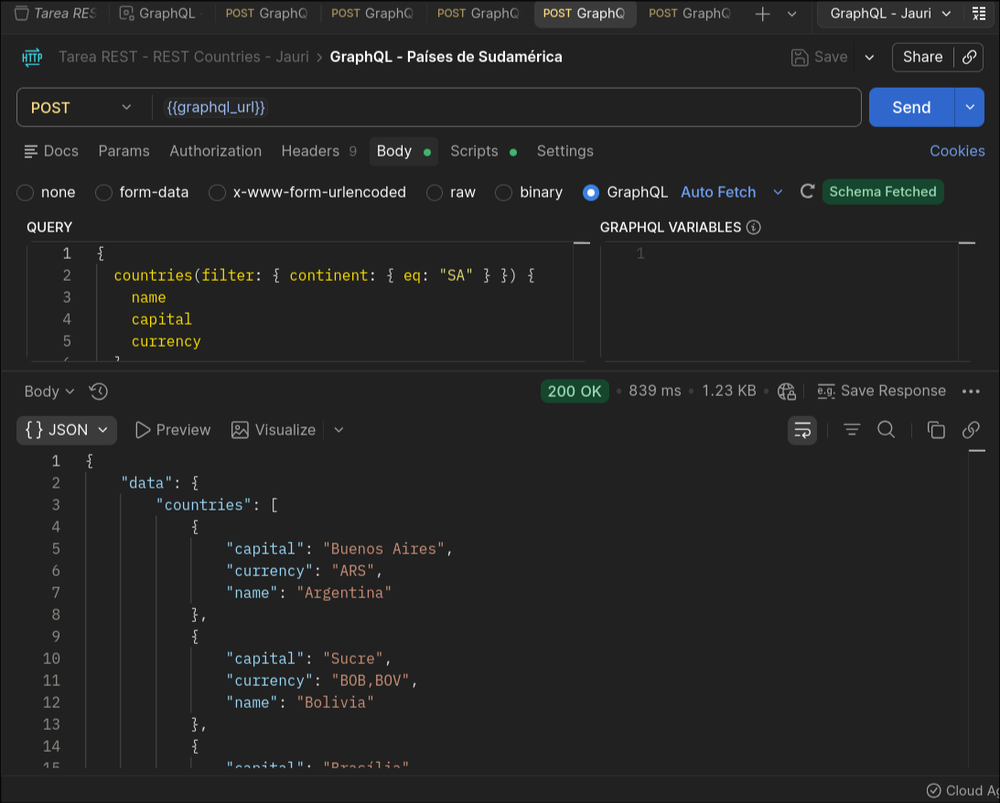
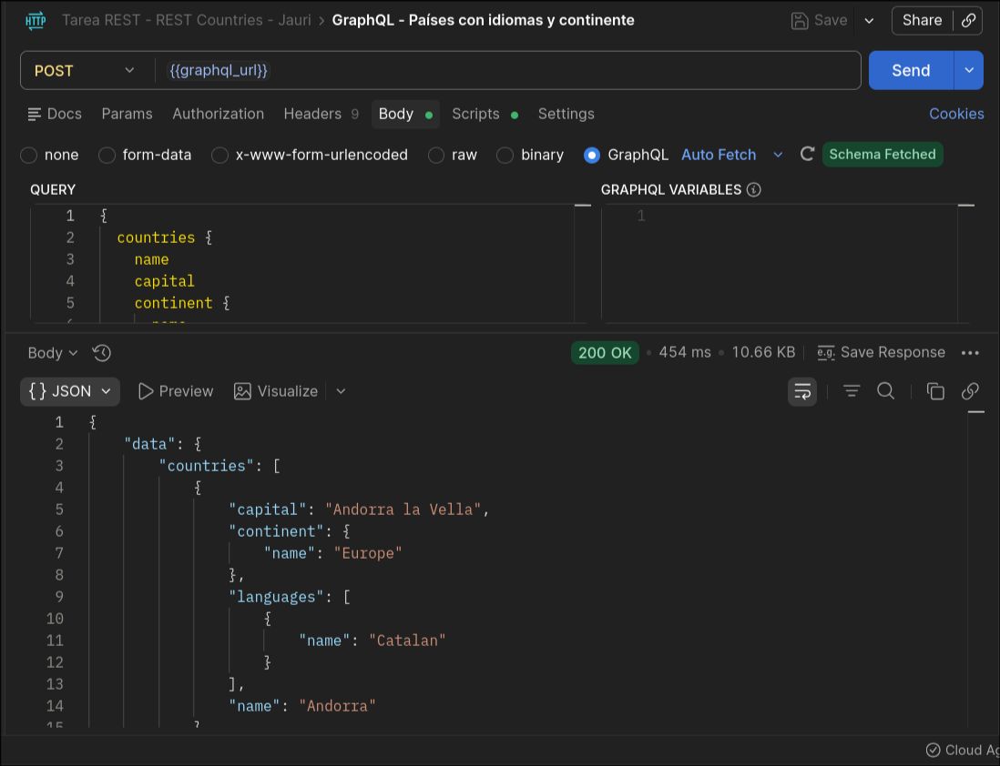

# Tarea APIs — Jauri

Exploración de APIs públicas con Postman, comparando REST y GraphQL usando datos de países del mundo.

---

## Parte 1 — REST API · `restcountries.com`

**API elegida:** REST Countries `https://restcountries.com/v3.1`  
**Autenticación:** Ninguna — API pública de solo lectura.

A diferencia de JSONPlaceholder, esta no es una API de práctica: los datos son reales y no hay endpoints de escritura (POST / PUT / DELETE). Solo GET. Eso obliga a pensar en cómo extraer exactamente lo que se necesita en cada request.

### Variables de colección

| Variable | Valor |
|---|---|
| `base_url` | `https://restcountries.com/v3.1` |
| `country_code` | `CO` |

---

### Request 1 — Todos los países (con campos acotados)

`GET /all?fields=name,capital,population,region,flags`

El endpoint `/all` devuelve los ~250 países del mundo. Sin el parámetro `fields`, la respuesta pesa varios MB. Acotando los campos a `name`, `capital`, `population`, `region` y `flags` baja a **138 KB** — suficiente para poblar una lista completa.



> **200 OK · 299 ms · 138.93 KB**

---

### Request 2 — Países por región

`GET /region/americas`

Filtrando por región se obtienen solo los países de las Américas. La respuesta sigue siendo un array grande (Bolivia aparece en la línea 1 de la respuesta), pero ya es un subconjunto manejable.



> **200 OK · 316 ms · 190.46 KB**

---

### Request 3 — Países por idioma

`GET /lang/spanish`

Un filtro distinto: todos los países de habla hispana. El primer resultado es México (`.mx`). El test verifica que el array no esté vacío (`length > 0`) y que el status sea 200.



> **200 OK · 186 ms · 81.19 KB**

---

### Request 4 — País por nombre

`GET /name/colombia`

Buscar por nombre devuelve el objeto completo del país. En la respuesta se ven campos anidados profundos: subregión (`South America`), fronteras (`BRA, ECU, PAN, PER, VEN`), área en km², y links a Google Maps y OpenStreetMap. El test confirma que `body[0].name.common === 'Colombia'`.



> **200 OK · 215 ms · 3.41 KB**

---

### Request 5 — País por código alpha

`GET /alpha/{{country_code}}`  *(variable `country_code = CO`)*

El mismo país, pero buscado por su código ISO. La respuesta expone el campo `name.nativeName` que tiene el nombre oficial del país en decenas de idiomas: `por` → "República da Colômbia", `rus` → "Республика Колумбия", `slk` → "Kolumbijská republika", `spa` → "República de Colombia". Eso no era visible en el request por nombre.



> **200 OK · 460 ms · 3.41 KB**

---

### Lo que aprendí diferente a JSONPlaceholder

- Esta API es de **solo lectura** porque los datos son reales, no de práctica.
- El endpoint `/all` exige declarar `fields` explícitamente si se quiere controlar el peso de la respuesta.
- Las respuestas tienen estructura más compleja (objetos anidados dentro de objetos), lo que da más material para escribir tests con significado.

---

## Parte 2 — GraphQL · `countries.trevorblades.com`

**API:** `https://countries.trevorblades.com/graphql`  
**Método:** POST — **un único endpoint** para todas las queries.

La diferencia central: en REST se elige el endpoint y la API decide qué campos devuelve. En GraphQL se escribe la query y se declara exactamente qué campos se quieren — ni más ni menos.

---

### Query 1 — Lista de continentes

La query más simple: solo pide `code` y `name` de cada continente. Devuelve los 7 en **1.01 KB**. Primera vez que se ve cómo se estructura una respuesta GraphQL: el dato siempre llega dentro de `data.{ nombre_del_query }`.



> **200 OK · 439 ms · 1.01 KB**

---

### Query 2 — País por código (Colombia)

```graphql
{
  country(code: "CO") {
    name
    capital
    currency
    phone
  }
}
```

Mismo país que en REST, pero ahora la query declara exactamente qué campos importan. La respuesta pesa solo **978 B** — frente a los 3.41 KB del REST equivalente — porque no incluye ningún campo no solicitado. Capital: Bogotá, moneda: COP, código telefónico: +57.



> **200 OK · 374 ms · 978 B**

---

### Query 3 — Catálogo de idiomas

```graphql
{
  languages {
    code
    name
    native
    rtl
  }
}
```

Una query a un recurso diferente dentro del mismo endpoint. Devuelve todos los idiomas del mundo con su nombre nativo y si se escriben de derecha a izquierda (`rtl`). En REST habría que saber si existe un endpoint `/languages` — aquí el esquema lo expone directamente.



> **200 OK · 236 ms · 4.2 KB**

---

### Query 4 — Países de Sudamérica (filtro por continente)

```graphql
{
  countries(filter: { continent: { eq: "SA" } }) {
    name
    capital
    currency
  }
}
```

GraphQL admite argumentos de filtro directamente en la query. El resultado muestra Argentina (Buenos Aires / ARS), Bolivia (Sucre / BOB,BOV), Brasil... — solo los países del continente pedido, sin lógica extra en el cliente.



> **200 OK · 839 ms · 1.23 KB**

---

### Query 5 — Países con idiomas y continente (query anidada)

```graphql
{
  countries {
    name
    capital
    continent {
      name
    }
    languages {
      name
    }
  }
}
```

Esta es la query más compleja: trae países junto con sus datos relacionados — continente e idiomas — en **una sola petición**. Andorra aparece con `continent: Europe` y `languages: [Catalan]`, todo en el mismo objeto. En REST esto requeriría mínimo **3 requests separados** (países → continente → idiomas).



> **200 OK · 454 ms · 10.66 KB**

---

## REST vs GraphQL — comparación directa

| | REST | GraphQL |
|---|---|---|
| Endpoints | Uno por recurso (`/all`, `/region`, `/lang`...) | Un único endpoint |
| Método HTTP | GET | POST |
| Control de campos | Limitado (parámetro `?fields`) | Total — declarado en la query |
| Datos relacionados | Múltiples requests | Una sola query anidada |
| Autenticación | No requerida | No requerida |
| Respuesta más pesada | `/region/americas` · 190 KB | Países+idiomas+continente · 10.66 KB |

## ¿En qué proyecto real usarías GraphQL?

En una app de viajes. Cada pantalla necesita datos distintos de un mismo país: la pantalla de lista solo necesita nombre y bandera; la pantalla de detalle necesita capital, moneda, idiomas, código de llamada y continente. Con REST se reciben los mismos campos pesados en ambas pantallas. Con GraphQL cada pantalla hace su propia query pidiendo exactamente lo que muestra — sin overfetching, sin underfetching.

---

## Entregables

- [`REST/Tarea REST - REST Countries - Jauri.postman_collection.json`](REST/Tarea%20REST%20-%20REST%20Countries%20-%20Jauri.postman_collection.json) — Colección REST
- [`GraphQL/Tarea GraphQL - Jauri.postman_collection.json`](GraphQL/Tarea%20GraphQL%20-%20Jauri.postman_collection.json) — Colección GraphQL
- Capturas en [`/REST`](REST/) y [`/GraphQL`](GraphQL/)
